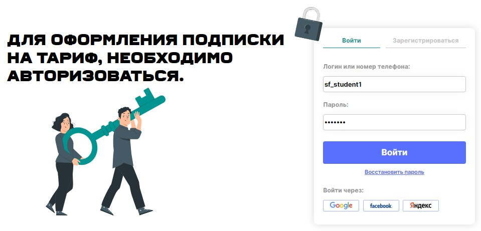
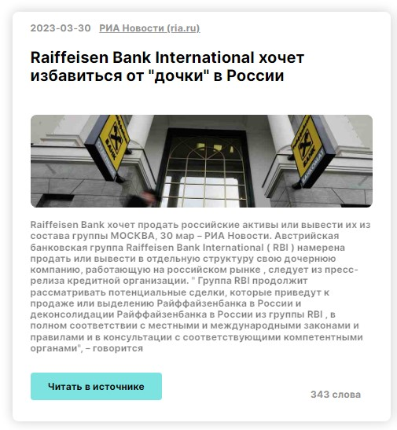

# Сервис СКАН

СКАН - *API* для поиска публикаций о компании (юридическом лице) в средствах массовой информации по его ИНН. Макет сайта находится по [ссылке](https://www.figma.com/file/u3MOjzYnTnirz712GrLbFv/Макет-СКАН).

## Описание интерфейса

Клиентская часть сервиса состоит из:

  - главной страницы,

    

  - формы авторизации,

    

  - формы для ввода параметров запроса,

    

  - страницы с выводом результатов запроса.

    

## **Шапка сайта**

В шапке сайта находятся:

- логотип,

- меню,
- панель управления учётной записью.

Шапка сайта выглядит по-разному для авторизованного и неавторизованного пользователя.

**Шапка сайта для неавторизованного пользователя:**

1. Ссылка «Зарегистрироваться» - заглушка.
2. Кнопка «Войти» ведёт на страницу авторизации.

**Шапка сайта для авторизованного пользователя:**

1. Вместо кнопок «Зарегистрироваться» и «Войти» - аватар пользователя с именем и кнопкой «Выйти».

2. Кнопка «Выйти» сбрасывает авторизацию.

3. Слева от аватара - панель с информацией о лимите по компаниям в аккаунте и количестве уже используемых компаний. Эта информация подгружается не сразу, во время выполнения запроса крутится лоадер.

4. Страница «Тарифы» - ссылка на раздел с тарифами.

   

5. Страница «*FAQ*» - заглушка.

## **Главная страница**

Главная страница содержит описание сервиса и доступна всем пользователям без авторизации.

**Обратите внимание** на следующие пункты:

1. Кнопка «Запросить данные» ведёт на страницу ввода параметров поиска. Она видна только зарегистрированному пользователю.

   

2. Карточки в разделе «Почему именно мы» переключаются по принципу карусели: клик на стрелке слева или справа переключает карточки в соответствующем направлении.

   Данный слайдер реализован с помощью библиотеки React-Slick.

   

3. В разделе «Наши тарифы» перечислены возможные тарифы. Кнопка «Подробнее» — заглушка.

   Если пользователь авторизован, карточка с используемым им тарифом должна выглядит иначе, чем осталные:

   - - появляется бейдж «Текущий тариф»;
     - кнопка «Подробнее» меняется на «Перейти в личный кабинет» (она также не функциональна);
     - карточка выделяется рамкой соответствующего тарифу цвета.

   

   

## **Форма авторизации**

Эта страница содержит форму с полями для ввода логина и пароля. При заполнении пароля вводимое значение должно маскироваться.

При отсутствии одного из значений — логина или пароля — кнопка «Войти» неактивна, и при клике на неё ничего не происходит.

Для демонстрации функциональности сайта логин и пароль уже заполнены

После ввода всех необходимых значений кнопка становится активной. При нажатии на неё нужно отправляется запрос на `POST account/login`.

При **успешной авторизации** в ответе на запрос придут:

- - токен авторизации (`accessToken`),
  - дата, до которой токен действителен (`expire`).

Эти данные сохраняются в `localStorage`, чтобы пользователю не нужно было заново авторизоваться после каждого обновления страницы.

В случае **неуспешного запроса** показывается сообщение сообщение об ошибке:

Остальные элементы формы не функциональны:

- вкладка «Зарегистрироваться»,
- ссылка «Восстановить пароль»,
- кнопки «Войти» через *Google*/*Facebook*/Яндекс.

## **Форма для ввода параметров запроса**

Данная страница содержит основу функционала сервиса: форму, где пользователь задаёт параметры поиска.

Эта страница доступна только авторизованным пользователям. Если неавторизованный пользователь пытается её открыть - его переадресует на главную страницу сервиса.

Обязательные поля отмечены звёздочками. Если хотя бы одно из обязательных полей не заполнено, кнопка «Поиск» будет неактивна.

Если введённый ИНН не соответствует формату - выводится ошибка.

Введённый диапазон (дата начала и конца поиска) необходимо также проверять на корректность:

- даты не должны быть в будущем времени;
- дата начала не может быть позже даты конца.

Если эти условия не выполняются, нужно показать сообщение об ошибке:

Если поисковый запрос введён корректно, по нажатии на кнопку «Поиск» выполняется запрос `POST objectsearch/histograms` и открывается страница с результатами запроса.

## **Вывод результатов поиска**

1. В момент выполнения запроса на странице результатов показывается лоадер и сообщение "Загружаем данные" / "Загрузка".

2. После выполнения запроса в компоненте "Общая сводка" показывается слайдер с датами публикаций.

3. В разделе "Список документов" расположены карточки публикаций. 

   

   - В шапке карточки выводится дата публикации и название источника. Название является также ссылкой на оригинал статьи.

   - Под заголовоком публикации может быть несколько тегов : 
     - Анонс
     - Дайджест (сводки новостей)
     - Технические новости

4. Внизу карточки находятся кнопка «Читать в источнике», которая открывает в новой вкладке оригинальную статью, и количество слов. 

5. Найденных публикаций может быть много (лимит поиска — 1000 результатов). Поэтому реализована *ленивая загрузка* *(lazy loading)*. Сначала подгружаются только 10 первых результатов. По нажатии кнопку «Показать больше» подгружаются следующие 10 результатов. И так до тех пор, пока не будут загружены последние из найденных публикаций.

   